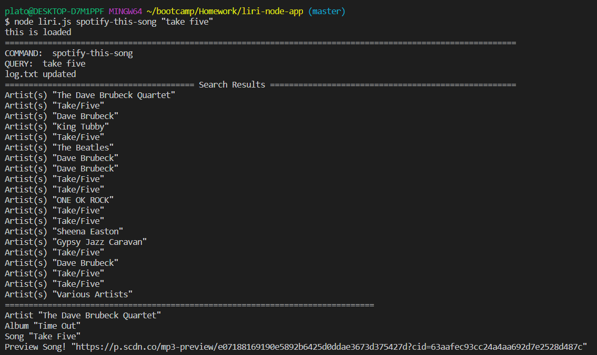
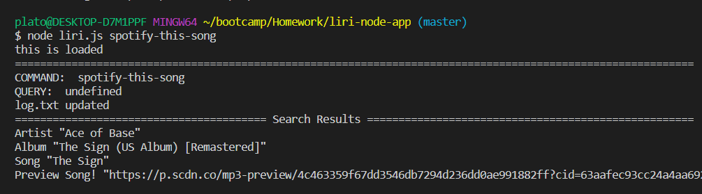
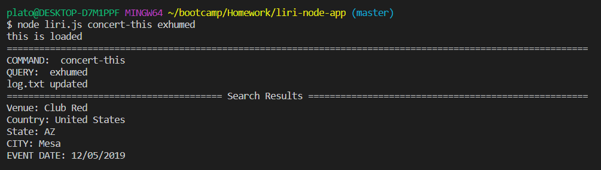
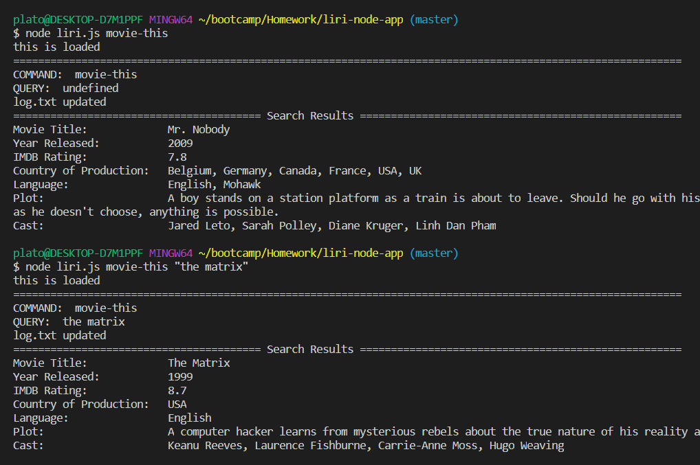
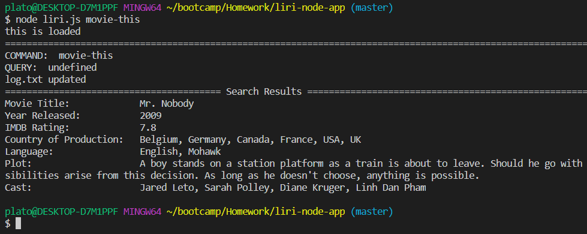
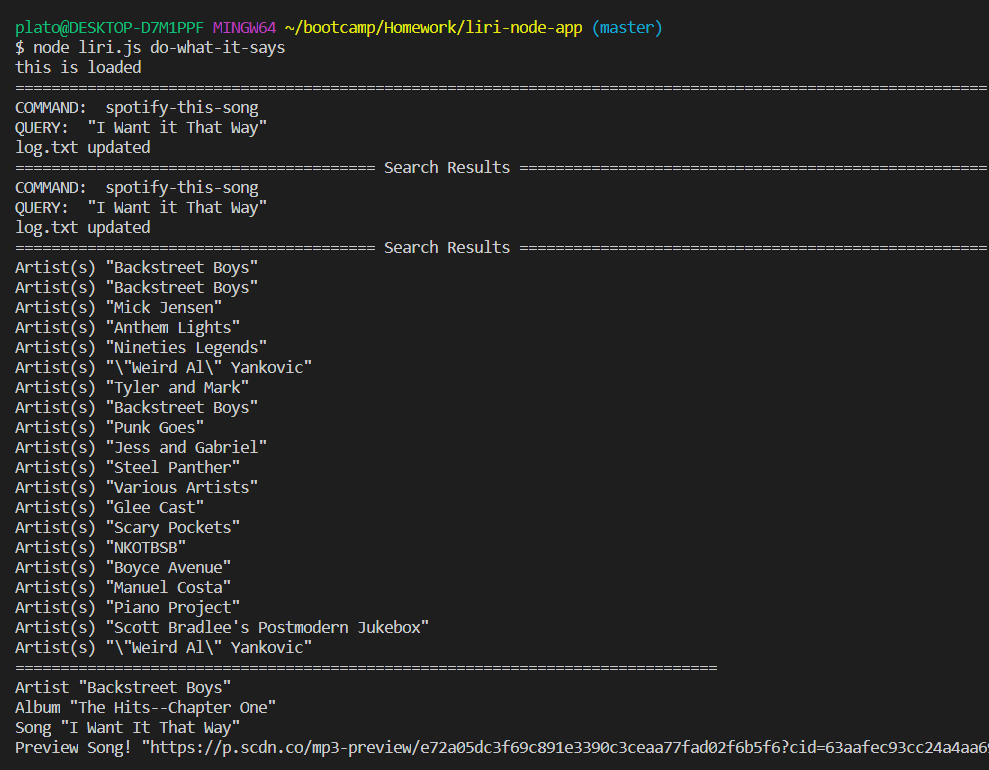

# liri-node-app
A Node-js Application! LIRI will search Spotify for songs, Bands in Town for concerts, and OMDB for movies all from the comfort of your Terminal!

### Introduction
* LIRI stands for Language Interpretation and Recognition Interface.
* LIRI is a command Line application that takes in parameters and returns data in the Terminal.
* LIRI will accept any of the following commands
	1. spotify-this-song
	2. concert-this
	3. movie-this
	4. do-what-it-says

* type in 'node liri.js' into the terminal and instructions will display about how to use the different commands

* What the functions do!

* node liri.js spotify-this-song 'song title'
    this will output the following information to the terminal

    * Artist(s)
    * The song's name
    * A preview link of the song from Spotify
    * The album that the song is from

* node liri.js concert-this 'Band name'
    this will output the following information to the terminal

    * Name of the venue
    * Venue location
    * Date of the Event "MM/DD/YYYY"
    
* node liri.js movie-this 'movie title'
    This will output the following information to your terminal/bash window:

       * Title of the movie.
       * Year the movie came out.
       * IMDB Rating of the movie.
       * Rotten Tomatoes Rating of the movie.
       * Country where the movie was produced.
       * Language of the movie.
       * Plot of the movie.
       * Actors in the movie.

* node liri.js do-what-it-says
    this will read commands and queries from the random.txt file and run the corresponding function. In this case 'spotify-this'
# Here I searched Take Five on spotify!

# Here I left the search blank!

# Here I searched Exhumed on Bands In Town!

# Here I searched Nothing on OMDB!

# Here I searched The Matrix on OMDB!

# The do what it says command searched for query saved in Random.txt


* These are the npm packages I used and are needed to run the app
	1. fs package in node
	2. [Node-Spotify-API](https://www.npmjs.com/package/node-spotify-api)
	3. [DotEnv](https://www.npmjs.com/package/dotenv)
    4. [Axios](https://www.npmjs.com/package/axios)
        * [OMDB API](http://www.omdbapi.com)
        * [Bands In Town API](http://www.artists.bandsintown.com/bandsintown-api)

* to install these npm packages run these commands one at a time.
```
npm install Node-Spotify-API
npm install DotEnv
npm install Axios
